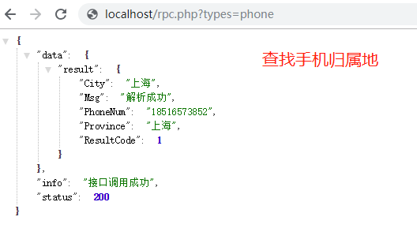
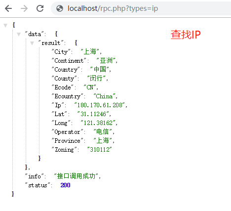

### ztool工具使用

### 下载安装

	wget https://github.com/zouhuigang/software/raw/master/ztool-1.0.0-1.x86_64.rpm
	yum localinstall -y ztool-1.0.0-1.x86_64.rpm

### 启动/停止

	systemctl start ztool
	systemctl stop ztool

### 卸载

	yum remove ztool

### 截图

	